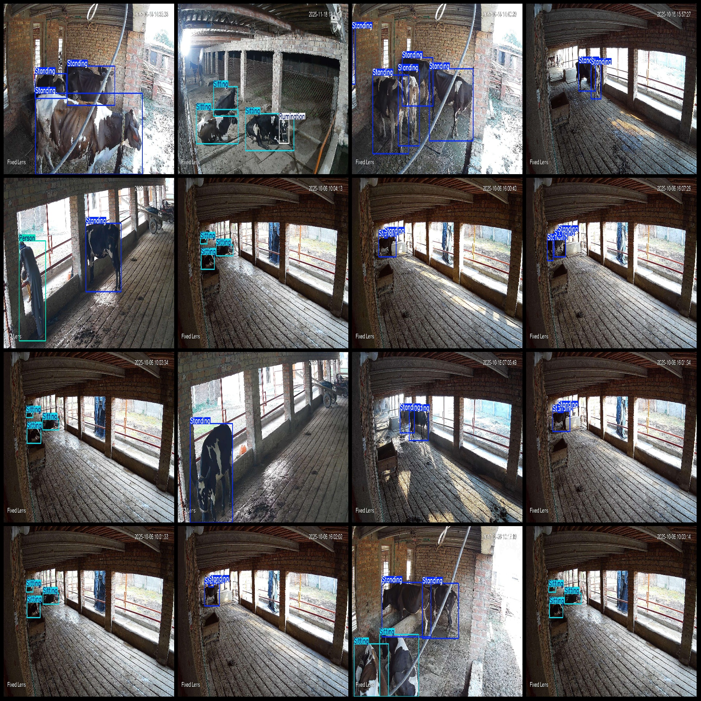
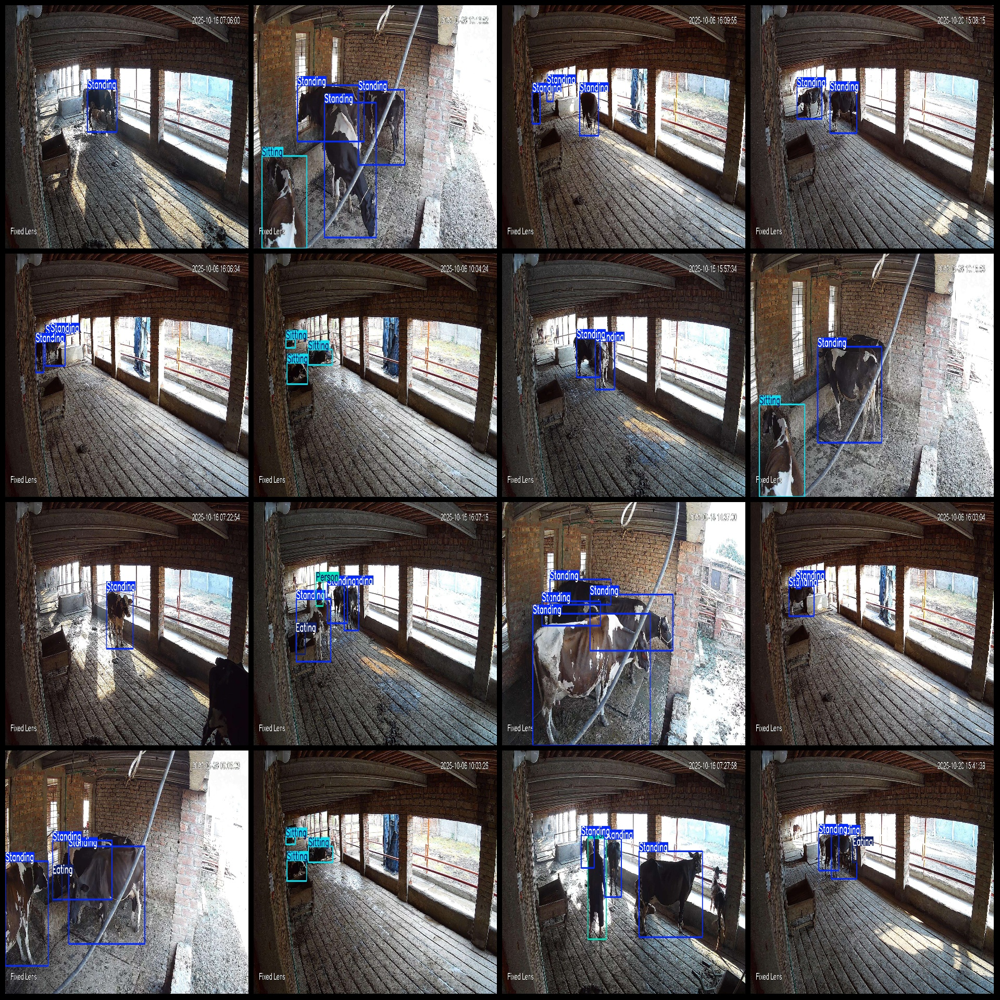

# Intelligent Beef Cattle Behavior Activity State Detection Dataset VOC+YOLO format, 2113 categories

Dataset format: Pascal VOC format+YOLO format(without split path in txtfile, only containing jpgimage and corresponding VOC format xmlfile and yolo format txtfile)
number of images: 2113  
annotation count: 2113  
annotation count: 2113  
annotationnumber of classes: 5  
Annotation class names (Note: the order of yolo formatclass doesn't match this, but it is based on the labelsfile/classes.txt): ["Eating", "Person", "Rumination", "Sitting", "Standing"]
boxes per class:   
Eating box count = 727  
Person box count = 248  
Rumination box count = 104  
Sitting box count = 829  
Standing box count = 5005  
total boxes: 6913  
images per class:   
Eating images = 641  
Person images = 211  
Rumination images = 100  
Sitting images = 338  
Standing images = 1880
image resolution: 1920x1080  
Using the annotation tool: labelImg.
Annotation rules: draw a rectangle around the class.
Important notes: The dataset does not have a division of training, validation, and test sets; you need to divide it yourself.
Special statement: This dataset does not guarantee the accuracy of the models or weightsfile used in training.
Image preview:
## Images

Here is a pay link on Stripe ( https://buy.stripe.com/3cs8yP7sY87d0vu9AB ). Please contact me lonlonago@foxmail.com after funding $89, and I will send you a complete data files , thank you!

